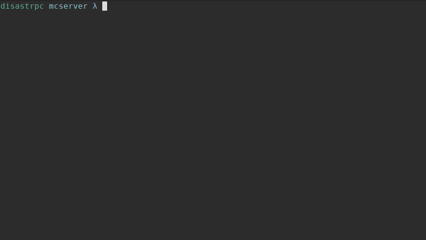

# Torch
## A Minecraft Server Wrapper Written in Go



## Dear god why?

This project started after I failed to find a reliable server restart utility available for the latest versions of Minecraft, and since most plugin APIs are still not updated, that route was also closed. 

I first attempted to write a script using Python, however the speed at which the server wrote to stdout was too much for it to handle and issues started arising, so I did what any sane person would do and started learning Go for its great concurrency and speed.

## How it works

Torch wraps around and starts your JVM instance for you, it will then initiate a timer based upon the values provided. It listens on STDOUT for keywords originating from the server, and inputs its own commands through STDIN. 

## Compatibility

Torch should be compatible with all Minecraft versions. 


# Download and Installation

## Pre-Compiled Binares

Windows and Linux binaries are available under the releases section.

## Compile from Source

Clone and run the go build command on the root of the repo:

```
git clone https://github.com/disastrpc/torch
cd torch\
go build
```

# Usage

Simply place the torch binary and the torch.conf file inside your Minecraft server folder and setup the configuration values to your server which are explained below. The Torch binary can be run by double clicking it or running it from the command line. 

## Configuration File - torch.conf

An empty configuration file is provided in the repo, but one can also be created. The layout is in JSON format with the following options:

- `javpath`: Path to your java binary, if using your PATH simply leave this as 'java'.
- `jarfile`: Path to the jar file of your server.
- `jvmargs`: List of arguments to pass to the server jar file. Must be in format ["arg1","arg2"]
- `interval`: Amount of time in seconds the server will be restarted in.
- `warncount`: Number of warnings that will be issued before restarting server.
- `warnmsg`: Warning message to display. Not implemented.
- `rebootmsg`: Message to display before restarting. Not implemented.

## Command Line Arguments

Torch also supports command line arguments which will override the configuration options:

```
usage: Torch [-h|--help] [-j|--java-path "<value>"] [-J|--server-jar "<value>"]
             [-a|--jvm-args "<value>" [-a|--jvm-args "<value>" ...]]
             [-i|--interval <integer>]

Arguments:

  -h  --help        Print help information
  -j  --java-path   Java arguments to execute. Default: 
  -J  --server-jar  Provide path to server jar file. Default: 
  -a  --jvm-args    Provide JVM arguments that server-jar will execute.
                    Default: []
  -i  --interval    Interval server will restart. In seconds. Default: 0
```

## Dependencies

Torch is dependant upon the following libraries:

- [cview](https://gitlab.com/tslocum/cview) - Fork of Tview, provides commonly needed components for terminal based user interfaces.
- [tcell](https://github.com/gdamore/tcell) - Tcell is a Go package that provides a cell based view for text terminals, like XTerm.

